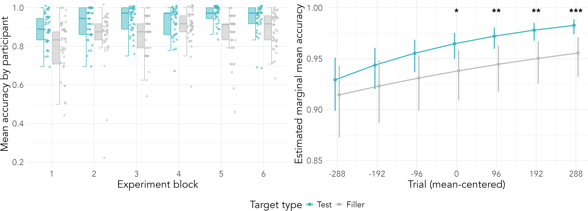

```{r knitr_setup, include = FALSE, message = FALSE, warning = FALSE}
# knitr settings
knitr::opts_chunk$set(echo = FALSE, warning = FALSE, message = FALSE)
```

```{r setup, child = "code/erp_analysis.Rmd", include = FALSE, message = FALSE, warning = FALSE, cache = TRUE}
```

# Background

```{r intro, out.width = "100%", out.extra = "", dpi = 300}

```

- Talker-specific adaptation: Participants who train on Talker A during exposure tend to perform better on Talker A during test than participants who train on Talker B
- Adaptation to L2-accented talkers in **behavior**: Higher transcription accuracy during sentence comprehension (e.g., Clarke & Garrett, 2004) and faster reaction times during cross-modal priming (e.g., Xie et al., 2017)
- Adaptation to L2-accented talkers in **ERPs** has not been targeted systematically; rather, studies have compared mean ERPs between experiment halves (Gosselin et al., 2021; Hanulíková et al., 2012; Romero-Rivas et al., 2015)

# Methods

```{r exp_design, out.width = "100%", out.extra = "", dpi = 300}

```

# Key results

<div class = "my-div">Target accuracy by prime type</div>

```{r test_prime, out.width = "100%", out.extra = "", dpi = 300}

```

<div class = "my-div">Grand mean ERPs by prime type</div>

```{r grand_erp, out.width = "100%", out.extra = "", dpi = 300}

```

<div class = "my-div">ERP responses by prime type</div>

```{r marginal_erp, out.width = "100%", out.extra = "", dpi = 300}

```

<div class = "my-ack"><font size = 4>*Supported by BCS-2234907 to Zaharchuk and Van Hell, BCS-2041264 to Van Hell, and University Graduate Fellowship to Zaharchuk*</font></div>

# Key take-aways

- Differential sensitivity to prime type emerged on the N1 as differences in priming decreased on the N400
- N1 modulation may reflect a shift in selective attention toward acoustic information (Joos et al., 2014)
- N400 modulation may reflect a concomitant shift away from lexical information
- Accent adaptation may involve a shift from top-down to bottom-up word recognition mechanisms

# Additional results

<div class = "my-div">Target accuracy comparison</div>

```{r test_filler, out.width = "100%", out.extra = "", dpi = 300}

```

<div class = "my-div">Correlation analysis</div>

```{r corr_dat, out.width = "100%", out.extra = '', dpi = 300}

```

# Additional methods

- Participants: 41 Penn State undergrads, grad students, and community members
  - Mean age of 20 (18-35)
  - One excluded from ERP analyses (head injury)
  - All grew up speaking English at home
    - Four identified as bilingual (self-rated proficiency less than 3/5)
    - Four grew up in multilingual households 
    - Three indicated a dialect background other than American English (British, Canadian, Caribbean)
- Talker: Spanish-English bilingual from Mexico City, Mexico; age 31 at time of recording; moved to US at age 28; began acquiring English in school (age 5)

# References

<div class = "my-text"><font size = 4>Chodroff, E., Golden, A., & Wilson, C. (2019). Covariation of stop voice onset time across languages: Evidence for a universal constraint on phonetic realization. *The Journal of the Acoustical Society of America*, *145*(1), EL109-EL115.</font></div>

<div class = "my-text"><font size = 4>Clarke, C. M., & Garrett, M. F. (2004). Rapid adaptation to foreign-accented English. *The Journal of the Acoustical Society of America*, *116*(6), 3647–3658.</font></div>

<div class = "my-text"><font size = 4>Flege, J. E., & Bohn, O. S. (2021). The revised speech learning model (SLM-r). *Second language speech learning: Theoretical and empirical progress*, *10*(9781108886901.002).</font></div>

<div class = "my-text"><font size = 4>Gosselin, L., Martin, C. D., Navarra-Barindelli, E., & Caffarra, S. (2021). The presence of a foreign accent introduces lexical integration difficulties during late semantic processing. *Language, Cognition and Neuroscience*, *36*(9), 1086-1106.</font></div>

<div class = "my-text"><font size = 4>Hanulíková, A., Van Alphen, P. M., Van Goch, M. M., & Weber, A. (2012). When one person's mistake is another's standard usage: The effect of foreign accent on syntactic processing. *Journal of Cognitive Neuroscience*, *24*(4), 878-887.</font></div>

<div class = "my-text"><font size = 4>Joos, K., Gilles, A., Van de Heyning, P., De Ridder, D., & Vanneste, S. (2014). From sensation to percept: the neural signature of auditory event-related potentials. *Neuroscience \& Biobehavioral Reviews*, *42*, 148-156.</font></div>

<div class = "my-text"><font size = 4>Kleinschmidt, D. F. (2019). Structure in talker variability: How much is there and how much can it help? *Language, Cognition and Neuroscience*, *34*(1), 43–68.</font></div>

<div class = "my-text"><font size = 4>Kleinschmidt, D. F., & Jaeger, T. F. (2015). Robust speech perception: recognize the familiar, generalize to the similar, and adapt to the novel. *Psychological Review*, *122*(2), 148-203.</font></div>

<div class = "my-text"><font size = 4>Romero-Rivas, C., Martin, C. D., & Costa, A. (2015). Processing changes when listening to foreign-accented speech. *Frontiers in Human Neuroscience*, *9*, 167.</font></div>

<div class = "my-text"><font size = 4>Xie, X., Theodore, R. M., & Myers, E. B. (2017). More than a boundary shift: Perceptual adaptation to foreign-accented speech reshapes the internal structure of phonetic categories. *Journal of Experimental Psychology: Human Perception and Performance*, *43*(1), 206-217.</font></div>
